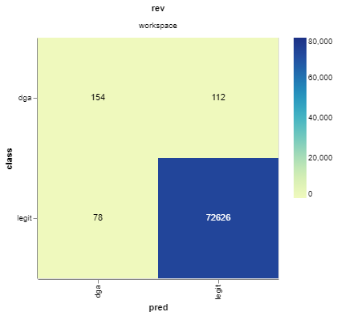

# A reproducible DVC pipeline from the notebook Detecting Algorithmically Generated Domains

The aim of this exercise, which is the lab assignment for the Social Computing course, is to create a reproducible pipeline from the notebook [Detecting Algorithmically Generated Domains](notebook/DGA_Domain_Detection.ipynb) using [DVC](https://dvc.org/), an open-source version control system for data science and machine learning projects.

The notebook, part of the Data Hacking collection on security-oriented data analysis, is related to the classification of legit domains and domains generated by a DGA (Dynamic Generation Algorithm).

The following section describe the process followed to create the pipeline starting from the notebook. If you are not interested in this, you can skip directly to the [setup instructions](#setup).

## Process

### 🗃️ Raw datasets download

After downloading and understanding the content of the notebook, the raw datasets have been downloaded from the [Git repository associated to the notebook](https://github.com/SuperCowPowers/data_hacking/tree/master/dga_detection) and, after the initialization of DVC (with the command `dvc init`), they have been copied in the folder `data/raw` and tracked using the `dvc add` command.

The dataset used are three:
- `alexa_1M`: contains a list of the top domain names from [Alexa](https://www.alexa.com/)
- `dga_domains`: contains a list of DGA domain names
- `words.txt`: a list of words taken from the dictionary

> Notice that the original repository contains two different Alexa datasets: `alexa_100k` and `alexa_1M`. The former contains a list of the top 100k domains from Alexa, while the latter contains a list of the top 1M domains. In this exercise, it has been chosen to use the second dataset `alexa_1M` because it has a bigger file size and it is more suitable for the purpose of this exercise (e.g. it is a compressed .zip file and thus an additional decompressing stage can be added to the pipeline). On the other hand, the original notebook uses the first dataset (but just for speed reasons).

### 📒 Notebook code cells to Python modules

First of all, the code cells of the notebook have been converted in a single Python script using the `nbconvert` tool with the following command:
```sh
jupyter nbconvert --to script DGA_Domain_Detection.ipynb
```

Following this, the single Python script has been analyzed in detail to identify the main stages of the data science experiment. In particular, four main stages have been identified:
1. Data preparation
2. Feature engineering
3. Training
4. Evaluation

These stages are further divided in sub-stages. For instance, the data preparation stage contains the sub-stage which prepares the Alexa dataset, the one which prepares the DGA dataset, etc.

Then, the single script has been divided in several Python modules, each of which contains the code to execute a stage of the pipeline. During this process, it has been tried to preserve as much of the original code as possible, but in some cases it has been necessary to correct some syntactical errors and update/adapt the code to make it work with the current version of the libraries used. Moreover, all the code that just print some strings on the standard output has been removed.

It is also important to mention that some parts of the notebook (e.g., the RandomForestClassifier class) return results based on a pseudo-random number generator. Hence, in contrast with the original notebook, it has been chosen to fix a random seed in order to achieve a deterministic behaviour and output reproducible results.

The modules extracted from the notebook are in the [`src` folder of this repository](/src) and they are organized in multiple sub-folders according to the main stage that they perform: `preparation`, `feature`, `models` and `evaluation`. Each of the modules take in input a set of arguments, that allow to specify the input files, and produces one or more outputs. Except from the evaluation module, all the other modules output `.pkl` files using the Python library `pickle`.

### ⚙️ Definition of the parameters

Some of the functions defined in the Python modules have specific parameters and hyperparameters that can be changed to alter the experiment and the output results.

In order to track these parameters and to allow the comparison of multiple runs, it has been chosen to add the file `params.yaml`, a YAML file which contains the parameters for the modules organized in a hierarchy. The content of the YAML file is reported below. Notice the three top level keys `preparation`, `features` and `models` which corresponds to some of the previously mentioned stages.

```yaml
preparation:
  seed: 0

features:
  alexa_vectorization:
    range_low: 3
    range_high: 5
    min_df: 0.0001
    max_df: 1.0
    
  words_vectorization:
    range_low: 3
    range_high: 5
    min_df: 0.00001
    max_df: 1.0

models:
  n_estimators: 20
  seed: 0
```

### 🔁 Creation of the reproducible pipeline

Each stage of the pipeline has been added using the `dvc run` command, specifying the input dependencies, the outputs and the command to execute. Except for the first stage (`extract-alexa`) where the command used is `unzip`, all the other stages execute one of the Python modules extracted from the code in the notebook (as described in the previous paragraph).

In addition to the parameters `-d` and `-o` to track the input dependencies and the output of each stage, two other parameters have been used: `-p` and `--plots`. The first one is used to specify one or more parameters the stage depends on (to allow to re-execution of the stage when the parameters change), the second instead, allow to define a special output produced by the stage, that is a plot metrics file (more on this in the [Plot metrics](#-plot-metrics) section).

The outputs of each stage are stored inside the `data` folder where they are organized in multiple sub-folders according to the stage. The structure of the `data` folder is reported below.
```console
$ tree
.
├── build-features
│   ├── test_set.pkl
│   └── training_set.pkl
├── evaluate
│   └── classes.csv
├── extract-alexa
│   └── alexa_1M.csv
├── merge-test
│   └── merged_test_set.pkl
├── merge-training
│   └── merged_training_set.pkl
├── prepare-alexa
│   └── alexa_prepared.pkl
├── prepare-dga
│   └── dga_prepared.pkl
├── prepare-words
│   └── words_prepared.pkl
├── raw
│   ├── alexa_1M.zip
│   ├── dga_domains.txt
│   └── words.txt
├── split-alexa
│   ├── alexa_test.pkl
│   └── alexa_train.pkl
├── split-dga
│   ├── dga_test.pkl
│   └── dga_train.pkl
└── train-model
    └── trained_model.pkl
```

#### High level description of the stages

The following table reports an high level description of each stage in the pipeline. To look more in depth at the stages, open the file [dvc.yaml](dvc.yaml) where all the stages that form the pipeline are specified, along with the command, the input dependencies, the outputs, etc.

|       Name       |                                                                                Description                                                                                |
|:----------------:|:-------------------------------------------------------------------------------------------------------------------------------------------------------------------------:|
|  *extract-alexa* | It extracts the .zip file that contains the Alexa dataset.                                                                                                                |
|  *prepare-alexa* | It prepares the Alexa dataset removing blanklines, setting the class of the domains, etc.                                                                                 |
|   *prepare-dga*  | It prepares the DGA domains dataset removing blanklines, setting the class of the domains, etc.                                                                           |
|  *prepare-words* | It prepares the words dataset removing duplicate words, lowering the case, etc.                                                                                           |
|   *split-alexa*  | It splits the prepared Alexa dataset in training set (90%) and test set (10%).                                                                                            |
|    *split-dga*   | It splits the prepared DGA dataset in training set (90%) and test set (10%).                                                                                              |
| *merge-training* | It merges the two training sets (Alexa training set and DGA training set) into a single one.                                                                              |
|   *merge-test*   | It merges the two test sets (Alexa test set and DGA test set) into a single one.                                                                                          |
| *build-features* | It builds the additional features that will be used to train the model. In particular, it adds the length and the entropy of each domain, and performs the vectorization. |
|   *train-model*  | It trains a Random Forest classifier model.                                                                                                                               |
|    *evaluate*    | It evaluates the performances of the trained model using the test set.                                                                                                    |

#### Directed acyclic graph (DAG) of the pipeline

DVC represents the stages of the pipeline through a directed acyclic graph with each of the stages in the pipeline as nodes. The graph for this exercise, generated with the `dvc dag` command, is reported below:
```console
$ dvc dag
                                   +--------------+
                                   | data\raw.dvc |***
                               ****+--------------+   *******
                           ****                  **          *******
                      *****                        **               *******
                   ***                               **                    *******
     +---------------+                                 **                         ****
     | extract-alexa |                                  *                            *
     +---------------+                                  *                            *
              *                                         *                            *
              *                                         *                            *
              *                                         *                            *
     +---------------+                          +-------------+                      *
     | prepare-alexa |                          | prepare-dga |                      *
     +---------------+                          +-------------+                      *
      **            **                                  *                            *
    **                **                                *                            *
  **                    **                              *                            *
**                  +-------------+              +-----------+                       *
*                   | split-alexa |              | split-dga |                       *
*                   +-------------+*****    *****+-----------+                       *
*                           *           ****            *                            *
*                           *      *****    *****       *                            *
*                           *   ***              ***    *                            *
****                +------------+             +----------------+            +---------------+
    *******         | merge-test |             | merge-training |          **| prepare-words |
           ******** +------------+             +----------------+   *******  +---------------+
                   *******        ***            **          *******
                          *******    **        **     *******
                                 ****  **    **   ****
                                  +----------------+
                                  | build-features |
                                  +----------------+
                                   **            **
                                 **                **
                               **                    **
                      +-------------+                  **
                      | train-model |                **
                      +-------------+              **
                                   **            **
                                     **        **
                                       **    **
                                     +----------+
                                     | evaluate |
                                     +----------+
```

### 📊 Plot metrics

The last stage of the pipeline (`evaluate`) outputs a CSV file which contains a row for each of the test domains and two columns: `class` and `pred`. The first is the actual class of the domain (`legit` or `dga`), the latter is the class predicted by the trained model.

Using the `dvc plots` command, it is possible to generate a confusion matrix to visualize the performance of the trained model (the exact command to generate the plot is reported in the [Plot confusion matrix](#plot-confusion-matrix) section).

Below is reported the confusion matrix generated after the training and the evaluation stages.



## Setup

The following instructions explain how to get a copy of the project on the local machine and setup it for development and testing purposes.

The project (and the instructions that follow) has been developed and tested on Windows 10, using Python 3.9.1 and DVC 1.11.8.

> ⚠ These instructions assumes that [Python 3.6+](https://www.python.org/downloads/) and [DVC](https://dvc.org/doc/install) are already installed on the local machine. If they are not, please install them before executing the following commands.

### Download

To download the content of this repository on the local machine simply execute the commands:
```sh
git clone https://github.com/davidelofrese/dvc-dga-notebook.git
cd dvc-dga-notebook
```

### Configuration

Before reproducing the pipeline, create a [Python virtual environment](https://docs.python.org/3/library/venv.html):
```sh
python -m venv .env
```

Then, activate it:

- Windows
```sh
source .env/Scripts/activate
```

- POSIX
```sh
source .env/bin/activate
```

Next, install the dependencies listed in the `requirements.txt` file:
```sh
pip install -r requirements.txt
```

### Data download

This exercise includes a preconfigured Google Drive remote storage that contains the raw datasets and the outputs of each stage of the pipeline.
```console
$ dvc remote list
gdrive  gdrive://14uIMjkjSUbisQ-quCbMhLUCU5f6DYo94
```

Before reproducing the pipeline, download the tracked files from the remote storage on the local machine running the command:
```sh
dvc pull
```

> ⚠ On the first execution of the pull command, DVC will generate an URL to authorize the access to Google Drive. Therefore, it is required to open the URL, sign into a Google account and grant DVC the necessary permissions. This will produce a verification code needed to complete the connection. Additional information on the autorization process are reported in the [DVC documentation](https://dvc.org/doc/user-guide/setup-google-drive-remote#authorization).

## Run

To reproduce the entire pipeline, run the command:
```sh
dvc repro
```

**⚠ Warning:** if the pipeline is reproduced right after a `dvc pull` command without any change to the stages' dependencies or parameters, the following output will be produced by DVC:
```console
$ dvc repro
'data\raw.dvc' didn't change, skipping
Stage 'prepare-words' didn't change, skipping
Stage 'extract-alexa' didn't change, skipping
Stage 'prepare-alexa' didn't change, skipping
Stage 'split-alexa' didn't change, skipping
Stage 'prepare-dga' didn't change, skipping
Stage 'split-dga' didn't change, skipping
Stage 'merge-test' didn't change, skipping
Stage 'merge-training' didn't change, skipping
Stage 'build-features' didn't change, skipping
Stage 'train-model' didn't change, skipping
Stage 'evaluate' didn't change, skipping
Data and pipelines are up to date.
```

Hence, to reproduce the pipeline even if no changes were made, use the `--force` parameter to force the execution:
```sh
dvc repro --force
```

### Plot confusion matrix

After the reproduction of the pipeline, it is possibile to generate the confusion matrix based on the output of the evaluation stage with the following command:
```sh
dvc plots show data/evaluate/classes.csv --template confusion -x pred -y class
```

This command will generate an HTML file (`plots.html`) which can be opened with a web browser to visualize the confusion matrix.

## Resources & Libraries

* [pandas](https://pandas.pydata.org/) - A data analysis and manipulation tool
* [numpy](https://numpy.org/) - Add support for large, multi-dimensional arrays and matrices
* [tldextract](https://pypi.org/project/tldextract/) - A tool to separate the TLD from the registered domain and subdomains of a URL
* [scikit-learn](https://scikit-learn.org/stable/) - A set of tools for predictive data analysis
* [pyaml](https://pypi.org/project/pyaml/) - Module to read and write YAML-serialized data

## Authors

* **[Davide Lofrese](https://github.com/davidelofrese)** - creation of the reproducibile DVC pipeline
* [Brian Wylie](https://github.com/brifordwylie) and [Mike Sconzo](https://github.com/sooshie) - authors of the notebook

## License

This project is licensed under the MIT License - see the [LICENSE](LICENSE) file for details.
